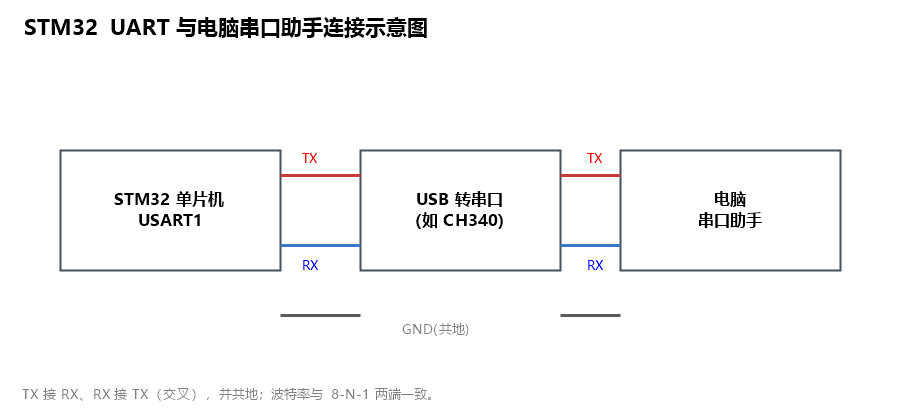

# 一、STM32 UART 串口通信入门

本文是一个**示例文档**，演示 `md2docx.py` 支持的全部 Markdown 特性：多级标题、**加粗**、`行内代码`、表格、图片、代码块、列表与分页。

> 章节编号直接写在标题文字里（如 `## 1. 串口基础`），导出的 Word 会自动建成标题层级；目录可在 Word 里用「引用 → 目录」自建。

## 1. 串口基础

### 1.1 什么是 UART

UART（通用异步收发器）是最常用的串行通信外设，用于低速、点对点的数据收发，典型场景是**调试打印日志**和**与模块通信**。

- **异步**：双方没有共享时钟，靠约定相同的波特率对齐时序。
- **串行**：数据一位一位传输，LSB 在前。
- **全双工**：TX（发送）和 RX（接收）各占一根独立线。

### 1.2 数据帧（8-N-1）

一个数据帧 = `起始位(1) + 8 数据位 + 停止位(1)`。8-N-1 表示 8 数据位、无校验、1 停止位，是最通用的串口配置。

## 2. 硬件连接

| 引脚 | 方向 | 说明 |
| --- | --- | --- |
| TX | 单片机 → 外设 | 发送数据 |
| RX | 外设 → 单片机 | 接收数据 |
| GND | 公共 | 必须共地 |

下面这张示意图演示 STM32 的 UART 与电脑串口助手的连接关系：



## 3. 代码示例

发送一个字符的典型实现：

```c
void uart_putc(char c) {
    while ((USART1->SR & USART_SR_TXE) == 0)
        ;
    USART1->DR = (uint8_t)c;
}
```

<!-- pagebreak -->

## 4. 小结

- UART 靠**波特率 + 帧格式**约定实现异步通信。
- 调试打印 = `printf 格式化 → 重定向 → UART 发送 → 串口助手解码显示`。

> 这就是本示例的全部内容，用来验证 md2docx 的完整转换链路。
